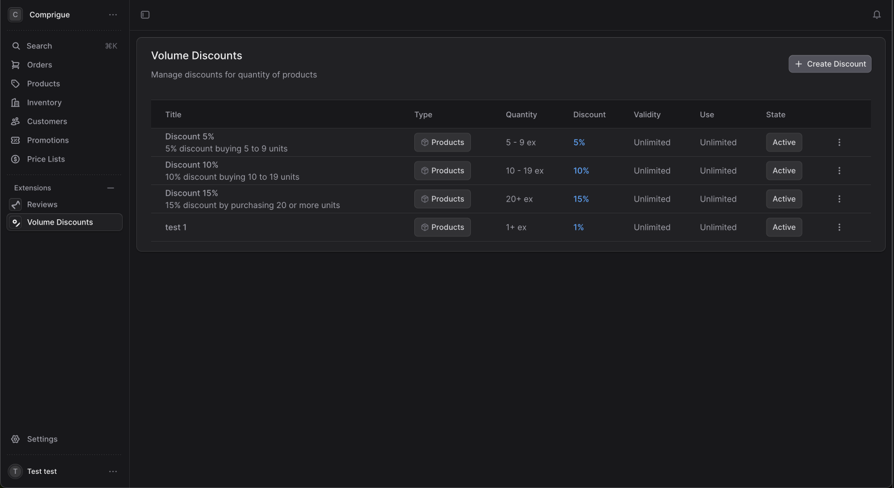

# How to Publish to GitHub

Follow these steps to publish your Medusa Volume Discounts Extension to GitHub:

## Step 1: Create GitHub Repository

1. Go to [GitHub](https://github.com/alvaropuche-stack) and sign in
2. Click the "+" icon in the top right corner
3. Select "New repository"
4. Fill in the details:
   - **Repository name**: `medusa-volume-discounts-extension`
   - **Description**: "A comprehensive volume discounts extension for Medusa v2 with advanced configuration options"
   - **Visibility**: Public
   - **Initialize**: Don't initialize with README (we already have one)

## Step 2: Initialize Git Repository

From your extension directory:

```bash
cd /Users/alvaropuche/Documents/GitHub/comprigur/medusa-volume-discounts-extension

# Initialize git repository
git init

# Add all files
git add .

# Create initial commit
git commit -m "feat: initial release of medusa volume discounts extension v1.0.0

- Complete volume discount functionality with product, category, and global discounts
- Professional admin interface with two-column layout  
- Advanced configuration options including time restrictions and usage limits
- Comprehensive API with full CRUD operations
- Complete documentation and usage examples
- Built by Zhenvo (Alvaro Puche Ortiz) for the Medusa community"

# Add remote repository
git remote add origin https://github.com/alvaropuche-stack/medusa-volume-discounts-extension.git

# Push to GitHub
git branch -M main
git push -u origin main
```

## Step 3: Configure Repository Settings

After pushing, configure your repository:

1. **Add Topics/Tags**:
   - Go to your repository on GitHub
   - Click the gear icon next to "About"
   - Add topics: `medusa`, `ecommerce`, `volume-discounts`, `bulk-pricing`, `medusajs`, `extension`

2. **Create Release**:
   - Go to "Releases" tab
   - Click "Create a new release"
   - Tag version: `v1.0.0`
   - Release title: `v1.0.0 - Initial Release`
   - Description:
   ```markdown
   🎉 **Initial Release of Medusa Volume Discounts Extension**
   
   A comprehensive volume discounts extension for Medusa v2 with advanced configuration options.
   
   ## ✨ Features
   - **Flexible Discount Types**: Product-specific, category-based, and global discounts
   - **Advanced Configuration**: Quantity ranges, priorities, time restrictions, usage limits
   - **Professional Admin UI**: Two-column interface with real-time preview
   - **Complete API**: Full REST API with comprehensive documentation
   - **Business Ready**: Usage tracking, conflict resolution, B2B support
   
   ## 📸 Screenshots
   
   
   See more screenshots in the [documentation](docs/screenshots/).
   
   ## 🚀 Quick Start
   Check out our [Installation Guide](docs/installation.md) to get started in minutes.
   
   ## 👨‍💻 Author
   Built with ❤️ by [Zhenvo](https://zhenvo.com) - [Alvaro Puche Ortiz](https://www.linkedin.com/in/alvaropucheortiz/)
   
   Specialized in e-commerce solutions and Medusa.js development.
   ```

3. **Enable GitHub Pages** (Optional):
   - Go to Settings > Pages
   - Source: Deploy from a branch
   - Branch: main / docs
   - This will make your documentation accessible at a URL

## Step 4: Share with Community

1. **Medusa Discord**:
   - Join the [Medusa Discord](https://discord.gg/medusajs)
   - Share in the `#community-plugins` channel

2. **Social Media**:
   - LinkedIn post about your new extension
   - Twitter/X announcement with #MedusaJS hashtag

3. **Medusa Community**:
   - Consider submitting to [Medusa's plugin directory](https://medusajs.com/plugins/)

## Step 5: Optional Enhancements

1. **Add GitHub Actions**:
   ```yaml
   # .github/workflows/ci.yml
   name: CI
   on: [push, pull_request]
   jobs:
     test:
       runs-on: ubuntu-latest
       steps:
         - uses: actions/checkout@v3
         - uses: actions/setup-node@v3
           with:
             node-version: '20'
         - run: npm ci
         - run: npm test
   ```

2. **Issue Templates**:
   ```markdown
   # .github/ISSUE_TEMPLATE/bug_report.md
   ---
   name: Bug report
   about: Create a report to help us improve
   ---
   
   **Describe the bug**
   A clear description of what the bug is.
   
   **Environment:**
   - Medusa version:
   - Node.js version:
   - Extension version:
   ```

3. **Pull Request Template**:
   ```markdown
   # .github/pull_request_template.md
   ## Description
   Brief description of changes
   
   ## Testing
   - [ ] Tests pass
   - [ ] Manually tested
   
   ## Documentation
   - [ ] Updated if needed
   ```

## Your Repository is Now Live! 🎉

Your extension is now available at:
**https://github.com/alvaropuche-stack/medusa-volume-discounts-extension**

People can now:
- ⭐ Star your repository
- 🍴 Fork it for their own projects  
- 🐛 Report issues
- 🤝 Contribute improvements
- 📦 Use it in their Medusa projects

Congratulations on creating and sharing your first Medusa extension! 🚀