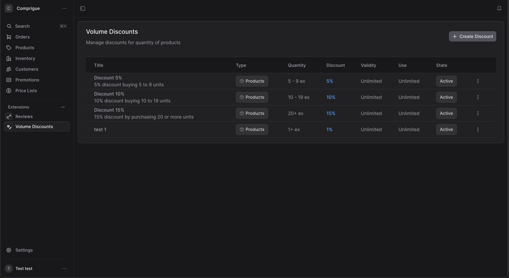

# Medusa Volume Discounts Extension

A comprehensive volume discounts extension for Medusa v2 that enables quantity-based pricing with advanced configuration options. Perfect for B2B stores, wholesale operations, and businesses that want to incentivize bulk purchases.

## Features

### **Flexible Discount Types**
- **Product-specific**: Apply discounts to selected products
- **Category-based**: Discount entire product categories  
- **Global**: Store-wide discounts with exclusion options
- **Percentage or Fixed**: Support for both percentage and fixed amount discounts

### **Advanced Configuration**
- **Quantity Ranges**: Set minimum and maximum quantities for each discount tier
- **Priority System**: Resolve conflicts when multiple discounts apply
- **Time-based Restrictions**: Set start and end dates for seasonal promotions
- **Usage Limits**: Control total usage and per-customer limits
- **Product Exclusions**: Exclude specific products from global/category discounts

### **Business-Ready Features**
- **Multi-product Selection**: Easy product picker with search functionality
- **Real-time Preview**: See discount effects before saving
- **Usage Tracking**: Monitor discount performance and usage statistics
- **Professional Admin UI**: Clean, intuitive interface built with Medusa UI components

### **Storefront Integration**
- **Automatic Application**: Discounts apply automatically at cart level
- **Tier Visualization**: Show available discounts to encourage larger purchases
- **API Endpoints**: Full REST API for custom implementations

## Screenshots

### Admin Interface

*Clean admin interface with comprehensive discount management and intuitive table layout*


*Professional two-column modal with product selection, advanced options, and real-time preview*


*Complete discount management with filtering, sorting, and bulk operations*

## ✨ Key Features Highlighted in Screenshots

- **📊 Professional Table View**: Clean, sortable table with all discount information at a glance
- **🎨 Modern UI/UX**: Built with Medusa UI components for seamless integration
- **⚡ Two-Column Modal**: Efficient workflow with configuration on the left, product selection on the right
- **🔍 Product Search**: Intuitive product picker with thumbnails and search functionality
- **📱 Responsive Design**: Works perfectly on all screen sizes
- **🎯 Real-time Preview**: See discount effects before saving

## Quick Start

### Backend Installation

1. **Copy the volume discount module to your Medusa project:**
```bash
cp -r src/backend/modules/volume-discount YOUR_MEDUSA_PROJECT/src/modules/
```

2. **Copy the API routes:**
```bash
cp -r src/backend/api/volume-discounts YOUR_MEDUSA_PROJECT/src/api/admin/
cp -r src/backend/api/store-volume-discounts YOUR_MEDUSA_PROJECT/src/api/store/volume-discounts
```

3. **Run database migrations:**
```bash
npx medusa db:migrate
```

### Frontend Installation

1. **Copy the admin page to your project:**
```bash
cp src/frontend/admin/volume-discounts-page.tsx YOUR_MEDUSA_PROJECT/src/admin/routes/volume-discounts/page.tsx
```

2. **Install required dependencies** (if not already present):
```bash
npm install lucide-react
```

3. **Restart your Medusa development server:**
```bash
npm run dev
```

4. **Access the admin interface:**
Navigate to `http://localhost:9000/app/volume-discounts`

## Configuration

### Environment Variables

No additional environment variables are required. The extension works out-of-the-box with your existing Medusa configuration.

### Module Configuration

The extension automatically registers itself as a Medusa module. You can configure it in your `medusa-config.js`:

```javascript
module.exports = defineConfig({
  modules: [
    {
      resolve: "./src/modules/volume-discount",
      options: {
        // Optional: Configure default settings
        enableUsageTracking: true,
        maxDiscountPercentage: 99,
      }
    }
  ]
})
```

## Usage Examples

### 1. B2B Wholesale Discounts

**Scenario**: Offer increasing discounts for bulk orders
- 5-9 items: 5% discount
- 10-24 items: 10% discount  
- 25+ items: 15% discount

**Configuration**:
```javascript
// Create three separate discounts with different priority levels
{
  title: "Bulk Discount Tier 1",
  discount_type: "global",
  min_quantity: 5,
  max_quantity: 9,
  discount_percentage: 5,
  priority: 1
}
```

### 2. Seasonal Product Promotions

**Scenario**: Holiday discount on gift sets
- Valid only during December
- 20% off when buying 3+ gift sets
- Limited to 100 total uses

**Configuration**:
```javascript
{
  title: "Holiday Gift Set Promotion",
  discount_type: "products", 
  product_ids: ["prod_gift_set_1", "prod_gift_set_2"],
  min_quantity: 3,
  discount_percentage: 20,
  valid_from: "2024-12-01T00:00:00Z",
  valid_until: "2024-12-31T23:59:59Z",
  usage_limit: 100
}
```

### 3. Category-based Discounts with Exclusions

**Scenario**: Electronics category discount excluding premium items
- 10% off electronics when buying 2+ items  
- Exclude high-end products from discount

**Configuration**:
```javascript
{
  title: "Electronics Volume Discount",
  discount_type: "categories",
  category_ids: ["cat_electronics"],
  excluded_product_ids: ["prod_premium_laptop", "prod_premium_phone"],
  min_quantity: 2, 
  discount_percentage: 10
}
```

## API Reference

### Admin Endpoints

#### `GET /admin/volume-discounts`
Retrieve all volume discounts with filtering options.

**Query Parameters:**
- `discount_type` - Filter by discount type (`global`, `products`, `categories`)
- `is_active` - Filter by active status (`true`, `false`)
- `limit` - Number of results to return (default: 20)
- `offset` - Number of results to skip (default: 0)

**Response:**
```javascript
{
  volume_discounts: [
    {
      id: "vd_01234567890",
      title: "Bulk Discount",
      discount_type: "global",
      min_quantity: 5,
      max_quantity: null,
      discount_percentage: 10,
      discount_value_type: "percentage",
      is_active: true,
      priority: 0,
      usage_count: 45,
      usage_limit: 100,
      // ... other fields
    }
  ],
  count: 1,
  offset: 0,
  limit: 20
}
```

#### `POST /admin/volume-discounts`
Create a new volume discount.

**Request Body:**
```javascript
{
  title: "New Volume Discount",
  discount_type: "products", // or "categories", "global"
  product_ids: ["prod_123", "prod_456"], // for product-specific
  min_quantity: 5,
  max_quantity: 10, // optional
  discount_value_type: "percentage", // or "fixed"  
  discount_percentage: 15, // when type is percentage
  // discount_fixed_amount: 50, // when type is fixed
  is_active: true,
  priority: 0,
  valid_from: "2024-01-01T00:00:00Z", // optional
  valid_until: "2024-12-31T23:59:59Z", // optional
  usage_limit: 100, // optional
  usage_limit_per_customer: 3 // optional
}
```

#### `PUT /admin/volume-discounts/:id`
Update an existing volume discount.

#### `DELETE /admin/volume-discounts/:id`  
Delete a volume discount.

### Store Endpoints

#### `GET /store/volume-discounts/:product_id`
Get available volume discounts for a specific product.

**Response:**
```javascript
{
  discounts: [
    {
      id: "vd_01234567890",
      title: "Buy More, Save More",
      min_quantity: 5,
      max_quantity: null,
      discount_percentage: 10,
      discount_value_type: "percentage"
    }
  ]
}
```

## Database Schema

### volume_discount Table
| Column | Type | Description |
|--------|------|-------------|
| id | TEXT | Primary key |
| title | TEXT | Display name for the discount |
| description | TEXT | Optional internal description |
| discount_type | TEXT | Type: global, products, categories |
| min_quantity | INTEGER | Minimum quantity required |
| max_quantity | INTEGER | Maximum quantity (null = unlimited) |
| discount_percentage | DECIMAL | Percentage discount (when type = percentage) |
| discount_value_type | TEXT | Value type: percentage or fixed |
| discount_fixed_amount | DECIMAL | Fixed discount amount (when type = fixed) |
| priority | INTEGER | Priority for conflict resolution |
| is_active | BOOLEAN | Whether discount is active |
| valid_from | TIMESTAMP | Start date (optional) |
| valid_until | TIMESTAMP | End date (optional) |
| usage_limit | INTEGER | Total usage limit (optional) |
| usage_count | INTEGER | Current usage count |
| usage_limit_per_customer | INTEGER | Per-customer limit (optional) |
| category_ids | JSONB | Array of category IDs (for category type) |
| excluded_product_ids | JSONB | Products to exclude (for global/category) |
| created_at | TIMESTAMP | Creation timestamp |
| updated_at | TIMESTAMP | Last update timestamp |

### volume_discount_product Table
| Column | Type | Description |
|--------|------|-------------|
| id | TEXT | Primary key |
| volume_discount_id | TEXT | Reference to volume_discount |
| product_id | TEXT | Reference to product |
| created_at | TIMESTAMP | Creation timestamp |

## Customization

### Extending the Admin UI

The admin interface is built with Medusa UI components and can be easily customized:

```typescript
// Add custom validation
const validateDiscount = (formData) => {
  if (formData.min_quantity > formData.max_quantity) {
    throw new Error("Minimum quantity cannot exceed maximum quantity")
  }
}

// Add custom discount types
const CUSTOM_DISCOUNT_TYPES = {
  "vip": {
    label: "VIP Customers", 
    icon: Crown,
    description: "Apply only to VIP customer segment"
  }
}
```

### Custom Storefront Components

Create React components to display volume discounts:

```tsx
import { useVolumeDiscounts } from './hooks/useVolumeDiscounts'

export const VolumeDiscountDisplay = ({ productId }) => {
  const { discounts, loading } = useVolumeDiscounts(productId)
  
  if (loading || !discounts.length) return null
  
  return (
    <div className="volume-discounts">
      <h3>Volume Discounts Available</h3>
      {discounts.map(discount => (
        <div key={discount.id} className="discount-tier">
          Buy {discount.min_quantity}+ items and save {discount.discount_percentage}%
        </div>
      ))}
    </div>
  )
}
```

## Troubleshooting

### Common Issues

**1. Discounts not appearing in admin**
- Ensure migrations have been run: `npx medusa db:migrate`
- Check browser console for JavaScript errors
- Verify API endpoints are responding: `curl http://localhost:9000/admin/volume-discounts`

**2. Discounts not applying in storefront**
- Confirm discount is active and within date range
- Check quantity meets minimum requirements
- Verify product is included in discount scope

**3. Multiple discounts conflicting**
- Use priority system to control which discount takes precedence
- Higher priority number = higher precedence
- Consider using mutually exclusive date ranges

### Debug Mode

Enable debug logging by setting:
```bash
DEBUG=medusa:volume-discounts npm run dev
```

## Contributing

We welcome contributions! Please see our [Contributing Guide](CONTRIBUTING.md) for details.

### Development Setup

1. Clone the repository
2. Install dependencies: `npm install`
3. Run tests: `npm test`
4. Start development server: `npm run dev`

### Testing

Run the full test suite:
```bash
npm run test
npm run test:integration
```

## License

MIT License - see [LICENSE](LICENSE) file for details.

## Author

**Created by [Alvaro Puche Ortiz](https://www.linkedin.com/in/alvaropucheortiz/)**  
**Company: [Zhenvo](https://zhenvo.com)**

Specialized in e-commerce solutions and Medusa.js development. Available for consulting and custom development projects.

## Support

- 📖 [Documentation](docs/)
- 🐛 [Issue Tracker](https://github.com/alvaropuche-stack/medusa-volume-discounts-extension/issues)
- 💬 [Discussions](https://github.com/alvaropuche-stack/medusa-volume-discounts-extension/discussions)
- 🌐 Website: [https://zhenvo.com](https://zhenvo.com)
- 💼 LinkedIn: [Alvaro Puche Ortiz](https://www.linkedin.com/in/alvaropucheortiz/)

## Changelog

### v1.0.0 - 2025-08-07
- Initial release with full volume discount functionality
- Support for product, category, and global discounts
- Advanced admin interface with two-column layout
- Time-based restrictions and usage limits
- Complete API documentation

## License

MIT License - Copyright (c) 2025 Alvaro Puche Ortiz (Zhenvo)

---

**Built with ❤️ by [Zhenvo](https://zhenvo.com) for the Medusa community**
